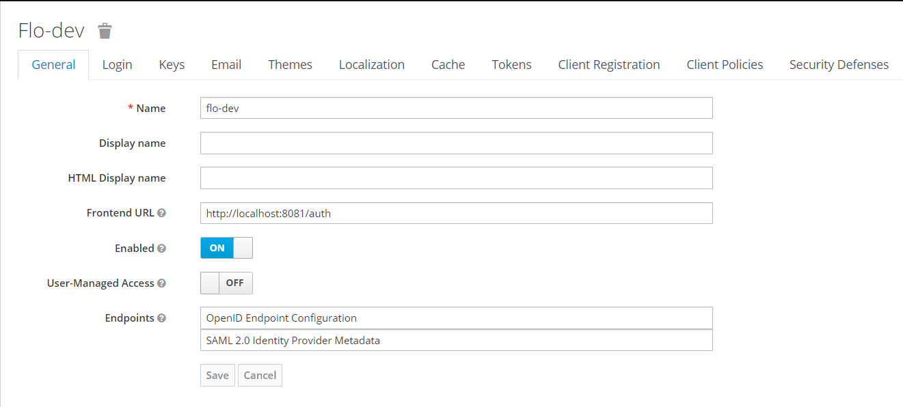

# Custom Embedded Keycloak Server in Spring Boot 

Source Reference:
````
https://github.com/thomasdarimont/embedded-spring-boot-keycloak-server
````

## Well-known Configuration 
````
http://localhost:<PORT>/auth/realms/<REAML-NAME>/.well-known/openid-configuration
````

## Keycloak token verification fails when the backend is running in a Docker container

The token is invalid, because the issuer (iss) in the token does not match the issuer that is expected by your backend service.

To fix this you can set the Frontend URL in your realm to http://localhost:<PORT>/auth. With this setting the issuer will no longer be determined in the request, but will be fixed http://localhost:<PORT>/auth/realms/<your-realm>.



## Dump postgresql for defined settings
Backup
````sh
pg_dump --host=localhost --port=5432 --dbname=keycloak --username=postgres --password > keycloak.sql
````